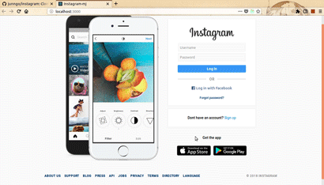

# Cloning Instagram

This project is cloning instagram project.

## Technical Stack
- Backend : Django(Python)
- Frontend : React(JavaScript)
- DB : Postgres
- [Required Package](./EnvironmentSetting.md)

## Basic Function
- Login, FaceBook Login
- Following / Unfollowing
- Like / Unlike
- Comment
- Show User Profile
- Feed(Show Images)
